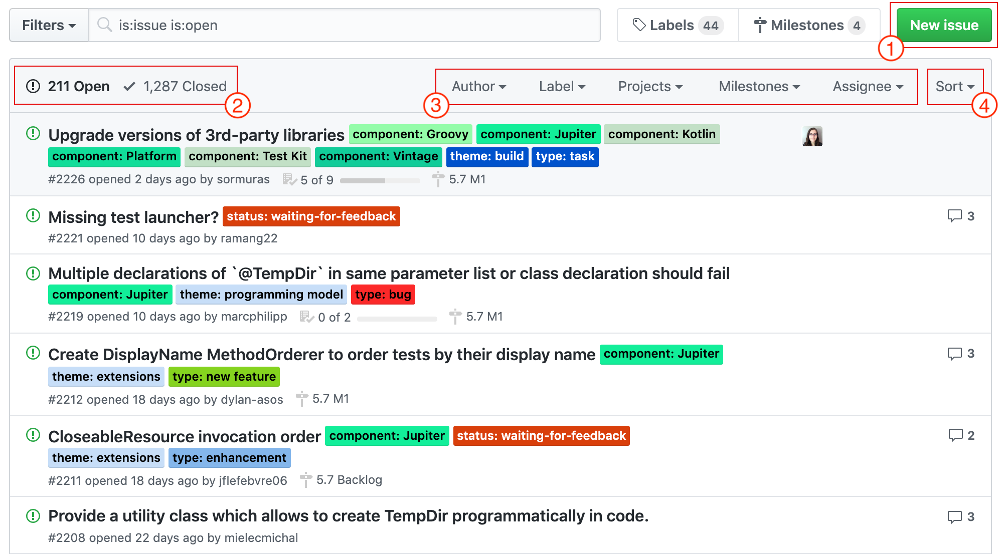
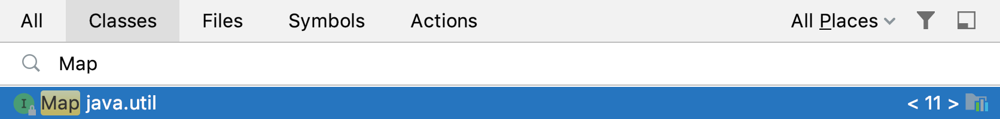

# Домашнее задание к занятию «Collections Framework. CRUD и тестирование систем, управляющих набором объектов»

В качестве результата пришлите ссылки на ваши GitHub-проекты в личном кабинете студента на сайте [netology.ru](https://netology.ru).

Все задачи этого занятия нужно делать в разных репозиториях.

**Важно**: если у вас что-то не получилось, то оформляйте Issue [по установленным правилам](../report-requirements.md).

Напоминалку по некоторым теоретическим моментам в джаве вы можете найти [здесь](../tips/tips.md).

## Как сдавать задачи

1. Ознакомьтесь с доп.материалами о [`final`](../extra/final.md) и [использованием примитивов с generic'ами](../extra/generics-and-primitives.md)
1. Инициализируйте на своём компьютере пустой Git-репозиторий
1. Добавьте в него готовый файл [.gitignore](../.gitignore)
1. Добавьте в этот же каталог необходимые файлы
1. Сделайте необходимые коммиты
1. Создайте публичный репозиторий на GitHub и свяжите свой локальный репозиторий с удалённым
1. Сделайте пуш (удостоверьтесь, что ваш код появился на GitHub)
1. Ссылку на ваш проект отправьте в личном кабинете на сайте [netology.ru](https://netology.ru)
1. Задачи, отмеченные, как необязательные, можно не сдавать, это не повлияет на получение зачета (в этом ДЗ все задачи являются обязательными)

## Задача №1 - Issues

### Легенда

Вы работаете в супер-амбициозной команде, которая разрабатывает [Test Management System (TMS)](https://en.wikipedia.org/wiki/Test_management_tool).

И поскольку многим знаком сервис GitHub 😎, была поставлена задача сделать систему управления Issue максимально похожей на ту, что есть в GitHub.

В качестве примера мы возьмём [список Issue JUnit5](https://github.com/junit-team/junit5/issues):

Какие функции должны быть реализованы:
1. Добавление Issue (набор полей и типы данных для дата-класса `Issue` определяете сами, но можете подсмотреть подсказку)
1. Отображение списка открытых и закрытых Issue (два отдельных метода, каждый из которых возвращает список из Issue)
1. Фильтрация* (3 отдельных метода):
    1. По имени автора (кто создал); т.е. метод фильтрации, принимающий, например, автора, и возвращающий список подходящих Issue.
    1. По Label'у (вам нужно проанализировать механику и подобрать нужный метод самостоятельно, но можете посмотреть подсказку).
    1. По Assignee (на кого назначено).
1. Сортировка (самостоятельно проанализируйте, какие сортировки вы бы хотели реализовать). Это необязательный пункт.
1. Закрытие/открытие Issue по id (фактически, это и есть update).

**Важно**: пункты, не указанные в списке, делать не нужно.

Примечание*: фильтрация - это операция возврата только тех объектов, которые удовлетворяют заданному условию (завёрнутых в коллекцию). В рамках стандартной библиотеки Java для этого существует специальный интерфейс `Predicate`. Мы не разбирали подробно функциональные интерфейсы в джаве как более продвинутую и углублённую тему, но если вы сможете по аналогии с `Comparator` реализовать метод `filterBy` в менеджере и передавать в него объект, удовлетворяющий интерфейсу `Predicate`, то это будет полезно. Но это необязательное требование.

Внутри репозитория (конечно же нужно всё разделить на manager и repository) все issue должны храниться в виде `List` (реализацию - `ArrayList` или `LinkedList` - выберите сами). Также вам надо написать дата-класс `Issue`.

  
Подсказки

  
  1. Подумайте над тем, чтобы хранить теги, assignee и некоторые другие поля в виде `Set` (т.к. например, теги не могут дублироваться)
  1. Подумайте над тем, чтобы передавать в фильтрацию теги в виде `Set` 

Опирайтесь на ту реализацию, которую мы рассматривали на лекции.

На основании раздела CRUD спроектируйте наборы тестов и протестируйте разные состояния системы (можете использовать Mockito для того, чтобы отдельно тестировать логику в менеджере).

Итого: у вас должен быть репозиторий на GitHub, в котором расположен ваш Java-код и автотесты к нему, GitHub Actions и т.д. (всё как обычно).

P.S. это задание довольно творческое, поэтому, если у вас возникают сомнения, вопросы или идеи, которые вам нужно обсудить, обязательно пишите в Slack.

## Задача №2 - `Map`*

**Важно**: это необязательная задача. Её (не)выполнение не влияет на получение зачёта по ДЗ.

**Важно**: эта задача повышенной сложности. Для её выполнения понадобится потратить время на самостоятельный анализ и чтение документации.

### Легенда

Один из ключевых навыков, который мы будем отрабатывать в рамках данного ДЗ, - это умение читать JavaDoc и примеры из него.

Почему именно этот навык? Не всегда для вас будут написаны готовые статьи и книжки, часто в лучшем случае у вас будет JavaDoc с примерами, в варианте похуже - просто исходники (в худшем - просто бинарные файлы без документации).

Интерфейс `Map` используется для хранения пар ключ-значение. Например, в операционной системе Windows каждому зарегистрированному типу файла (а на самом деле файлу с определённым расширением), сопоставлено приложение с помощью которого этот файл можно открыть.

Вам нужно прочитать документацию на интерфейс `Map` (два раза Shift в IDEA - Map):

Либо воспользоваться online-версией: https://docs.oracle.com/en/java/javase/11/docs/api/java.base/java/util/Map.html

Ключевые методы, документацию на которые нужно прочитать:
* `containsKey`
* `containsValue`
* `get`
* `set`
* `remove`
* `replace`
* `keySet`
* `values`

### Задача

Вам необходимо написать `FileOpenManager` (репозиторий делать не нужно), который умеет:
1. Регистрировать новое приложение для открытия файлов с определённым расширением (считайте, что приложение - это просто название, например "IntelliJ IDEA", "Adobe Photoshop" и т.д.).
1. Получать название приложения, предназначенного для открытия файла с определённым расширением.
1. Удалять привязку приложения к определённому расширению: тогда получается, что для данного расширения не будет зарегистрировано приложения для открытия (см. подсказки).
1. Получать список всех зарегистрированных расширений, к которым привязаны приложения для открытия (см.подсказки).
1. Получать список всех приложений, которые привязаны к каким-либо расширениям (см.подсказки).

В качестве ключа у вас должно быть расширение файла (например, `.html`), в качестве значения - название приложения (например, `Google Chrome`).

  
Подсказки

  
  1. Удаление привязки можно реализовать через удаление ключа.
  1. `Set` можно превратить в список (или в список положить `Set`), затем отсортировать по алфавиту.
  1. Удалить дубликаты из списка можно, "превратив" список в `Set` (это не всегда эффективно, но для нашей задачи вполне сгодится).

Обратите внимание: у файлов могут быть расширения в разном регистре: `.jpg` и `.JPG` 😈 - подумайте, как вы будете обрабатывать эти сценарии (будете ли вы считать это разными расширениями или одним и тем же).

Итого: у вас должен быть репозиторий на GitHub, в котором расположен ваш Java-код и автотесты к нему, GitHub Actions и т.д. (всё как обычно).
