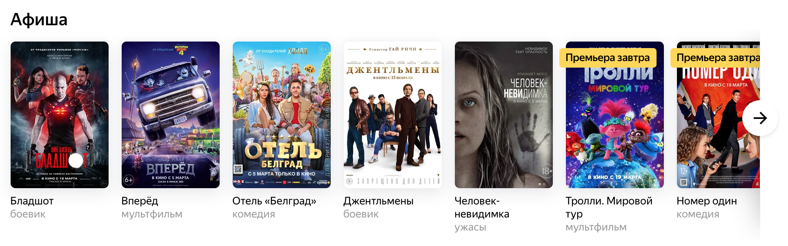

# Домашнее задание к занятию «Композиция и зависимость объектов. Mockito при создании автотестов»

В качестве результата пришлите ссылки на ваши GitHub-проекты в личном кабинете студента на сайте [netology.ru](https://netology.ru).

Все задачи этого занятия можно делать в одном репозитории.

**Важно**: если у вас что-то не получилось, то оформляйте Issue [по установленным правилам](../report-requirements.md).

Вы можете делать все задачи этого занятия в одном репозитории (если делаете их последовательно).

## Как сдавать задачи

1. Инициализируйте на своём компьютере пустой Git-репозиторий
1. Добавьте в него готовый файл [.gitignore](../.gitignore)
1. Добавьте в этот же каталог необходимые файлы
1. Сделайте необходимые коммиты
1. Создайте публичный репозиторий на GitHub и свяжите свой локальный репозиторий с удалённым
1. Сделайте пуш (удостоверьтесь, что ваш код появился на GitHub)
1. Ссылку на ваш проект отправьте в личном кабинете на сайте [netology.ru](https://netology.ru)
1. Задачи, отмеченные как необязательные, можно не сдавать, это не повлияет на получение зачета (в этом ДЗ все задачи являются обязательными)

## Задача №1 - "Менеджер Афиши"

### Легенда

На основе проекта с лекции необходимо реализовать менеджер Афиши (все фильмы хранятся внутри самого менеджера, без всякого репозитория):

Какие методы должны быть у менеджера?
1. Добавить фильм в ленту.
1. Выдать последние 10 добавленных фильмов* (фильмы выдаются в обратном порядке, т.е. первым в массиве результатов будет тот, который был добавлен последним).

Примечание*: если фильмов меньше 10, то выдаёте столько, сколько есть.

Сделайте так, чтобы по умолчанию выводилось последние 10 добавленных фильмов, но при создании менеджера можно было указать другое число, чтобы, например, выдавать 5 (а не 10).

Напишите необходимые, с вашей точки зрения, автотесты на различные состояния менеджера (можно их делать не в одном файле).

Требования к проекту:
1. Подключите плагин Surefire так, чтобы сборка падала в случае отсутствия тестов.
1. Подключите плагин JaCoCo в режиме генерации отчётов (обрушать сборку по покрытию не нужно).
1. Реализуйте нужные классы и методы.
1. Напишите автотесты на методы, содержащие логику, добившись 100% покрытия по branch'ам.
1. Подключите CI на базе Github Actions и выложите всё на Github.

Как делать:
1. Берёте код с лекции
1. Заливаете в свой репозиторий
1. Делаете новую ветку
1. В новой ветке делаете все изменения (Surefire, JaCoCo, методы, автотесты, CI)
1. Делаете Pull Request из этой ветки к своему же репозиторию

Итого: у вас должен быть репозиторий на GitHub, в котором расположен ваш Java-код и Pull Request.

## Задача №2 - "Менеджер Афиши" (divide and conquer)

### Легенда

В первой задаче создайте новую ветку `layers`, в которой разделите менеджера на менеджера и репозиторий.

В репозитории должны быть следующие методы:
1. `findAll` - возвращает массив всех хранящихся в массиве объектов
1. `save` - добавляет объект в массив
1. `findById` - возвращает объект по идентификатору (либо `null`, если такого объекта нет)
1. `removeById` - удаляет объект по идентификатору (если объекта нет, то пусть будет исключение, как на лекции)
1. `removeAll`* - полностью вычищает репозиторий

  
Подсказка

  
  Для удаления всех элементов достаточно в `items` положить пустой массив. 
  
  В Java встроен механизм, который называется Garbage Collection (сборка мусора), он сам удаляет из памяти машины неиспользуемые объекты.

Напишите автотесты на репозиторий (допускается, что как и в лекции на `removeById` может возникать исключение при удалении по несуществующему id).

Обеспечьте использование менеджером созданного вами репозитория (новых функций в менеджер по сравнению с первым заданием добавлять не нужно). Репозиторий должен быть зависимостью для менеджера (т.е. задаваться через конструктор и храниться в приватном поле).

Покройте менеджера автотестами, используя Mockito для организации моков репозитория.

Итого у вас должно быть:
1. Ветка `layers`, в которой должны быть классы `AfishaManager` и `AfishaRepository`
1. Автотесты на менеджер (с мокито) и на репозиторий (обычные автотесты), добившись 100% покрытия по branch'ам
1. Pull Request на Github (удостоверьтесь, что CI успешно проводит сборку*)

Примечание*: если вы реализовали тест на удаление по несуществующему id, то допускается, что сборка в CI будет failed.

Итого: у вас должен быть репозиторий на GitHub, в котором расположен ваш Java-код и Pull Request.
