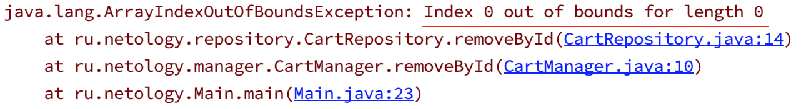

# Домашнее задание к занятию «Исключительные ситуации и их обработка. Тестирование исключений»

В качестве результата пришлите ссылки на ваши GitHub-проекты в личном кабинете студента на сайте [netology.ru](https://netology.ru).

Все задачи этого занятия нужно делать в разных репозиториях.
Не забываем про настройку CI в репозиториях с кодом.

**Важно**: если у вас что-то не получилось, то оформляйте Issue [по установленным правилам](../report-requirements.md).

Напоминалку по некоторым теоретическим моментам в джаве вы можете найти [здесь](../tips/tips.md).

## Как сдавать задачи

1. Инициализируйте на своём компьютере пустой Git-репозиторий
1. Добавьте в него готовый файл [.gitignore](../.gitignore)
1. Добавьте в этот же каталог необходимые файлы
1. Сделайте необходимые коммиты
1. Создайте публичный репозиторий на GitHub и свяжите свой локальный репозиторий с удалённым
1. Сделайте пуш (удостоверьтесь, что ваш код появился на GitHub)
1. Ссылку на ваш проект отправьте в личном кабинете на сайте [netology.ru](https://netology.ru)
1. Задачи, отмеченные как необязательные, можно не сдавать, это не повлияет на получение зачета

## Задача №1 - NotFoundException

### Легенда

Вы развиваете приложение с менеджером товаров, который мы рассматривали на лекции, и решили сделать так, чтобы при попытке удаления несуществующего объекта генерировалось ваше исключение, а не `ArrayIndexOfBoundsException`.

Обратите внимание: это правильный подход, поскольку таким образом вы сообщаете (через генерацию исключения), что это исключение, вписывающееся в вашу логику, а не ошибка программиста.

**Исключения являются частью API**.

Что нужно сделать:
1. Возьмите проект (мы его писали на одной из предыдущих лекций про наследование) с менеджером, репозиторием и товарами (`Product`, `Book`, `TShirt`)
1. Создайте класс исключения `NotFoundException` отнаследовавшись от `RuntimeException` и реализуйте как минимум конструктор с параметром-сообщением (он будет просто вызывать супер-конструктор предка, см. подсказку)
1. В методе удаления `removeById` сначала проверяйте, есть ли элемент (для этого прямо из метода `removeById` вызывайте метод `findById`: если результат - `null`, тогда выкидывайте исключение `NotFoundException`*)
1. Напишите 2 автотеста на репозиторий: первый должен проверять успешность удаления существующего элемента, второй - генерации `NotFoundException` при попытке удаления несуществующего элемента

<details>
<summary>Подсказка</summary>
Конструктор вашего исключения должен выглядеть как-то так:

```java
	public NotFoundException(String s) {
		super(s);
	}
```
</details>

Убедитесь, что ваши автотесты проходят (напоминаем, что проект должен быть на базе Maven, с подключенными зависимостями и необходимыми плагинами).

Итого: у вас должен быть репозиторий на GitHub, в котором расположен ваш Java-код и автотесты к нему.

Примечание*: обратите внимание, когда генерируются стандартные исключения, всегда передаётся сообщение (на английском языке), например:



Мы рекомендуем вам делать так же и указывать в сообщении: при удалении по какому конкретно id было сгенерировано ваше исключение.

Сделать это можно следующим образом (простейший способ): ```"Element with id: " + id + " not found"```.

Не забудьте подключить к проекту CI.

## Задача №2 - "Stack Trace"*

**Важно**: это необязательная задача. Её (не)выполнение не влияет на получение зачёта по ДЗ.

### Легенда

К вам пришло веб-приложение, которое необходимо запустить и проверить его работоспособность.

Smoke-тест этого приложения будет заключаться в следующем: при выполнении запуска по инструкции приложение стартует и доступно по адресу http://localhost:9999 (нужно открыть браузер и "ручками" вбить адрес http://localhost:9999).

### Инструкция

1. Скачайте файл [stracktrace.jar](artifacts/stacktrace.jar)
1. Откройте терминал в каталоге, в который вы скачали файл из п.1
1. Запустите приложение командой `java -jar stacktrace.jar`

### Задача

Выполните запуск приложения по инструкции, убедитесь, что оно падает с красивым Stack Trace'ом.

Важно: приложение специально написано так, чтобы упасть! Поэтому не пробуйте его починить!

Что нужно сделать: нужно оформить баг-репорт (не забудьте скопировать **весь стек-трейс**).

Для этого:
1. Создайте новый репозиторий
1. В репозитории создайте issue (ознкомьтесь с тем, [как оформлять issue в части кода](https://help.github.com/en/github/writing-on-github/basic-writing-and-formatting-syntax#quoting-code)*)
1. Приложите к issue либо ссылку на файл, либо сам файл (`stacktrace.jar`)

Важно: не закидывайте стек-трейс как обычный текст в issue! Оформляйте правильно и аккуратно (см ниже).

<details>
<summary>Как должен быть оформлен StackTrace</summary>
    
Он должен быть оформлен вот так (в тройных бэктиках):

```
Exception in thread "main" java.lang.UnsupportedClassVersionError: ru/netology/stacktrace/StacktraceApplication has been compiled by a more recent version of the Java Runtime (class file version 55.0), this version of the Java Runtime only recognizes class file versions up to 52.0
	at java.lang.ClassLoader.defineClass1(Native Method)
	at java.lang.ClassLoader.defineClass(ClassLoader.java:763)
	at java.security.SecureClassLoader.defineClass(SecureClassLoader.java:142)
	at java.net.URLClassLoader.defineClass(URLClassLoader.java:467)
	at java.net.URLClassLoader.access$100(URLClassLoader.java:73)
	at java.net.URLClassLoader$1.run(URLClassLoader.java:368)
	at java.net.URLClassLoader$1.run(URLClassLoader.java:362)
	at java.security.AccessController.doPrivileged(Native Method)
	at java.net.URLClassLoader.findClass(URLClassLoader.java:361)
	at java.lang.ClassLoader.loadClass(ClassLoader.java:424)
	at org.springframework.boot.loader.LaunchedURLClassLoader.loadClass(LaunchedURLClassLoader.java:92)
	at java.lang.ClassLoader.loadClass(ClassLoader.java:357)
	at org.springframework.boot.loader.MainMethodRunner.run(MainMethodRunner.java:46)
	at org.springframework.boot.loader.Launcher.launch(Launcher.java:87)
	at org.springframework.boot.loader.Launcher.launch(Launcher.java:51)
	at org.springframework.boot.loader.JarLauncher.main(JarLauncher.java:52)
```

А не вот так (просто лапшой текста):

Exception in thread "main" java.lang.UnsupportedClassVersionError: ru/netology/stacktrace/StacktraceApplication has been compiled by a more recent version of the Java Runtime (class file version 55.0), this version of the Java Runtime only recognizes class file versions up to 52.0
	at java.lang.ClassLoader.defineClass1(Native Method)
	at java.lang.ClassLoader.defineClass(ClassLoader.java:763)
	at java.security.SecureClassLoader.defineClass(SecureClassLoader.java:142)
	at java.net.URLClassLoader.defineClass(URLClassLoader.java:467)
	at java.net.URLClassLoader.access$100(URLClassLoader.java:73)
	at java.net.URLClassLoader$1.run(URLClassLoader.java:368)
	at java.net.URLClassLoader$1.run(URLClassLoader.java:362)
	at java.security.AccessController.doPrivileged(Native Method)
	at java.net.URLClassLoader.findClass(URLClassLoader.java:361)
	at java.lang.ClassLoader.loadClass(ClassLoader.java:424)
	at org.springframework.boot.loader.LaunchedURLClassLoader.loadClass(LaunchedURLClassLoader.java:92)
	at java.lang.ClassLoader.loadClass(ClassLoader.java:357)
	at org.springframework.boot.loader.MainMethodRunner.run(MainMethodRunner.java:46)
	at org.springframework.boot.loader.Launcher.launch(Launcher.java:87)
	at org.springframework.boot.loader.Launcher.launch(Launcher.java:51)
	at org.springframework.boot.loader.JarLauncher.main(JarLauncher.java:52)
</details>

Итого: у вас должен быть репозиторий на GitHub, в котором расположено ваше issue.

### "Заворачивание" исключений

Когда вы будете рассматривать Stack Trace, общая структура будет вот такой:

```
java.lang.IllegalStateException: Failed to execute CommandLineRunner
    ...
Caused by: org.springframework.jdbc.CannotGetJdbcConnectionException: Failed to obtain JDBC Connection; nested exception is com.mysql.cj.jdbc.exceptions.CommunicationsException: Communications link failure
    ...
Caused by: ...
```

Что это значит?

Если вы внимательно посмотрите на конструкторы исключений, то увидите, что есть возможность передавать другое исключение в качестве аргумента:

```java
public class RuntimeException extends Exception {
    ...
    public RuntimeException(String message, Throwable cause) {
        super(message, cause);
    }
    public RuntimeException(Throwable cause) {
        super(cause);
    }
    ...
}
```

Зачем это нужно?

Это позволяет организовать "заворачивание исключений", а именно: происходит какое-то исключение, его перехватывают с помощью `catch` и потом выбрасывают собственное:
```java
try {

} catch (CannotGetJdbcConnectionException e) {
    throw new IllegalStateException("CannotGetJdbcConnectionException", e);
}
```

"Переводится" это следующим образом: мы выкидываем своё исключение, потому что возникло другое исключение (в Stack Trace появляется `Caused by`).

Как вы видели из Stack Trace к текущему заданию, таких "вкладываний" может быть очень много, и самым вложенным является то, которое ниже всех по Stack Trace.

Именно так в большинстве фреймворков Checked исключения заворачивают в Unchecked, чтобы нам с вами не приходилось выносить исключения в сигнатуру или писать `try-catch`.
