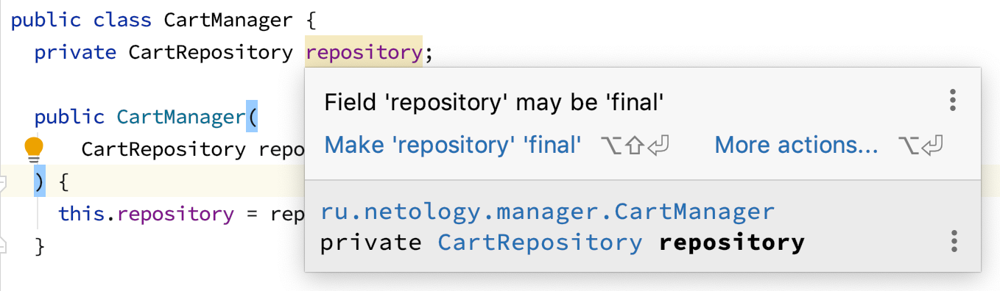
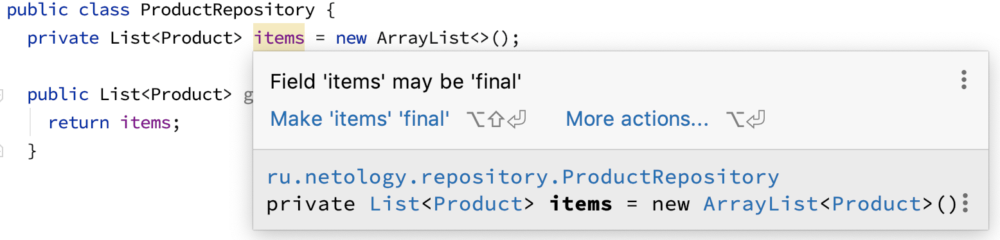

# `final`

В Java существует специальное ключевое слово `final`, у которого сразу несколько предназначений:
1. `final` на уровне класса (например, `public final class String`) означает, что автор класса решил, что вы не можете наследоваться от этого класса.
1. `final` на уровне метода (например, `public final native Class<?> getClass()`) означает, что автор класса решил, что вы не можете переопределить этот метод при наследовании.
1. `final` на уровне полей и переменных* означает возможность инициализировать что-то (присвоить) всего один раз.

Примечание*: на самом деле `final` можно писать и перед параметром метода (в объявлении), но это достаточно редкая практика.

Мы не рекомендуем вам использовать 1-2 варианты и рассмотрим более подробно третий вариант.

### Эмуляция констант

Рассмотрим эталонный пример - класс [`Math`](https://docs.oracle.com/en/java/javase/11/docs/api/java.base/java/lang/Math.html):
```java
public final class Math {
    public static final double E = 2.7182818284590452354;
    public static final double PI = 3.14159265358979323846;
    ...
}
```

В данном случае `final` говорит, что поля могут быть инициализированы только один раз: т.е. только один раз к имени `PI` будет привязано значение.

А поскольку значение - примитив, то и поменять мы его не сможем.

### `final` поля

Достаточно часто `final` используют для зависимостей, инициализируемых либо через инициализаторы полей, либо через конструкторы:





Используется это чаще всего для того, чтобы вы "случайно" не перезаписали это поле.

### `final` переменные

В случае с `final` переменными ситуация та же, что и с полями - используют это для того, чтобы "случайно" не перетереть значение переменной.

Использовать эту практику или нет, целиком зависит от стиля кодирования, который будет принят в вашей команде.

