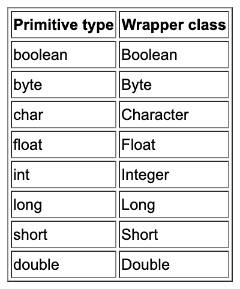
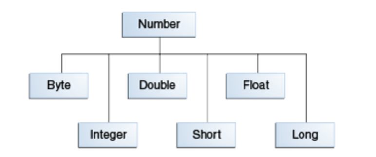

# Generic'и и примитивы

Generic'и в Java работают только с объектами, поэтому, вот этот код является невалидным:
```java
List<int> numbers = new ArrayList<>();
```

Что делать, если нам по каким-то причинам всё-таки нужно хранить примитивы?

Для этого в Java придумали Wrapper'ы (классы-обёртки) и автоматические операции boxing и unboxing.

О чём идет речь?

В Java спроектировали классы, объекты которых "заворачивают" (wrap) примитивные типы:

 

Для чисел эти классы образуют иерархию:



### Как использовать

На самом деле, всё достаточно просто и прозрачно: в generic'ах вы пишете классы обёртки:
```java
List<Integer> numbers = new ArrayList<>();
numbers.add(1); // Java за нас "завернёт" примитив в объект (boxing)
int first = numbers.get(0); // Java за нас "развернёт" объект в примитив (unboxing)
```

Иногда возникает соблазн везде вместо примитивов использовать объекты классов обёрток. Здесь всё зависит от стиля, принятого в команде, но есть два ключевых нюанса:
1. В переменные/параметры и поля примитивного типа нельзя положить `null`, а объектного - можно*
1. Любые объектные типы нужно сравнивать через `equals`** 

Примечание*: попробуйте ради интереса выполнить следующий код и разобраться (по исходникам класса `Integer`), почему так происходит:
```java
Integer wrapper = null;
int primitive = 0;
System.out.println(wrapper + primitive);
```

Примечание**: попробуйте ради интереса выполнить следующий код:
```java
Integer a = 10;
Integer b = 10;
System.out.println(a == b); // true***
System.out.println(a.equals(b)); // true
```

```java
Integer a = 1024;
Integer b = 1024;
System.out.println(a == b); // false***
System.out.println(a.equals(b)); // true
```
Примечание**: на самом деле результат выполнения этого кода будет зависеть от настроек JVM (здесь указан для дефолтных).

### Полезности

Кроме всего прочего, классы-обёртки предоставляют полезные методы для работы с объектами примитивного типа (например, преобразования в строку или парсинг из строки).

Поэтому, настоятельно рекомендуем вам посмотреть на список их методов и почитать JavaDoc'и.
