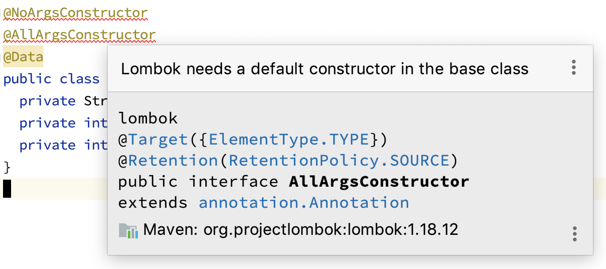
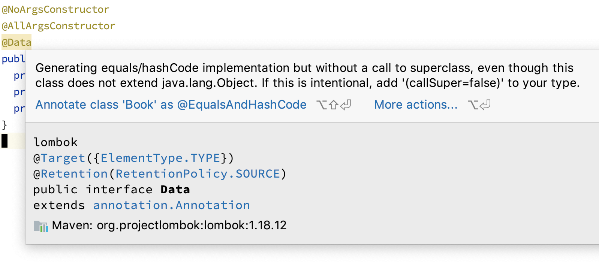

# Lombok и наследование

Lombok - это не магический инструмент, а инструмент кодогенерации.

И как любой инструмент, в любой непонятной ситуации он может реагировать только двумя способами:
1. Генерировать ошибку
1. Использовать поведение по умолчанию

Давайте рассмотрим пример с лекции: у нас есть базовый класс, но теперь уже с аннотациями Lombok'а:
```java
@NoArgsConstructor
@AllArgsConstructor
@Data
public class Product {
  private int id;
  private String name;
  private int price;
}
```

В результате мы получим класс с двумя конструкторами, `getters`/`setters`, `equals`, `hashCode`, `toString`

Теперь попробуем "навесить" те же самые аннотации на унаследованный класс:
```java
@NoArgsConstructor
@AllArgsConstructor
@Data
public class Book extends Product {
  private String author;
  private int pages;
  private int publishedYear;
}
```

Причём IDEA аннотацию `@Data` выделит жёлтым (но пока не об этом).

После компиляции (`mvn compile`) получим следующее:
```java
public class Book extends Product {
  private String author;
  private int pages;
  private int publishedYear;

  public Book() {
  }

  public Book(String author, int pages, int publishedYear) {
    this.author = author;
    this.pages = pages;
    this.publishedYear = publishedYear;
  }

  // другие методы
}
```

Т.е. никаких полей родителя не инициализировалось, а по факту прозошло следующее:
```java
public class Book extends Product {
  private String author;
  private int pages;
  private int publishedYear;

  public Book() {
    super(); // <-
  }

  public Book(String author, int pages, int publishedYear) {
    super(); // <-
    this.author = author;
    this.pages = pages;
    this.publishedYear = publishedYear;
  }

  // другие методы
}
```

Т.е. просто вызвался конструктор родительского класса без параметров (напоминаем: `super()` - вызов конструктора родителя).

Если вдруг мы уберём из родителя `@NoArgsConstructor`, то получим следующее:


Таким образом, если вы используете Lombok и хотите использовать наследование с вызовом конструктора с параметрами, то конструкторы в дочерних классах придётся писать "ручками".

Разберёмся с `@Data`:


Т.е. нужно добавить аннотацию `@EqualsAndHashCode` и указывать либо `callSuper=true` либо `callSuper=false`, чтобы точно специфицировать, нужно ли вызывать родительский метод.

## Итоги

По конструкторам: если вы используете Lombok и хотите использовать наследование с вызовом конструктора с параметрами, то конструкторы в дочерних классах придётся писать "ручками".
По `@Data`: нужно явно прописывать, вызывать методы родителя или нет.

Итоговая версия:
```java
@Data
@EqualsAndHashCode(callSuper = true)
public class Book extends Product {
  private String author;
  private int pages;
  private int publishedYear;

  public Book() {
  }

  public Book(int id, String name, int price, String author, int pages, int publishedYear) {
    super(id, name, price);
    this.author = author;
    this.pages = pages;
    this.publishedYear = publishedYear;
  }
}
```

P.S. в современном мире разное отношение и к наследованию, и к Lombok. Чаще всего наследование считается не лучшей идеей, поэтому особых проблем с Lombok быть не должно.
