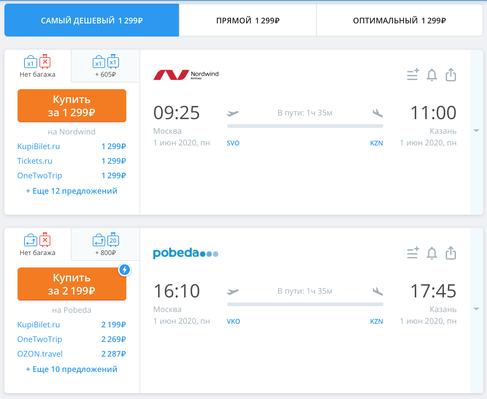

# Домашнее задание к занятию «Интерфейсы для организации малой связности. Обобщенное программирование (Generics)»

В качестве результата пришлите ссылки на ваши GitHub-проекты в личном кабинете студента на сайте [netology.ru](https://netology.ru).

Все задачи этого занятия нужно делать в одном репозитории.

**Важно**: если у вас что-то не получилось, то оформляйте Issue [по установленным правилам](../report-requirements.md).

Напоминалку по некоторым теоретическим моментам в джаве вы можете найти [здесь](../tips/tips.md).

## Как сдавать задачи

1. Инициализируйте на своём компьютере пустой Git-репозиторий
1. Добавьте в него готовый файл [.gitignore](../.gitignore)
1. Добавьте в этот же каталог необходимые файлы
1. Сделайте необходимые коммиты
1. Создайте публичный репозиторий на GitHub и свяжите свой локальный репозиторий с удалённым
1. Сделайте пуш (удостоверьтесь, что ваш код появился на GitHub)
1. Ссылку на ваш проект отправьте в личном кабинете на сайте [netology.ru](https://netology.ru)
1. Задачи, отмеченные как необязательные, можно не сдавать, это не повлияет на получение зачета

## Задача №1 - Поиск билетов

### Легенда

Вы работаете в сервисе по продаже авиабилетов онлайн. Вот как это выглядит на https://aviasales.ru*:



Примечание*: если у вас не доступен по каким-то причинам сайт, вы можете воспользоваться сохранённой [pdf-версией](assets/aviasales.pdf)

Что вам нужно сделать:
1. Спроектируйте класс для информации о "Билете"*
1. Реализуйте репозиторий для хранения информации о "Билетах" (добавить, удалить, получить список)
1. Реализуйте менеджера поиска по аэропорту вылета и аэропорту прилёта (даты не учитывайте)

Примечание*: конечно же, сущность, которую вы видите на экране, - это не билет, а предложение. Попробуйте придумать ей более логичное имя.

#### Информация о "Билете"

Класс информации о билете - это data-класс, который должен содержать:
1. id
1. Стоимость (для упрощения будем считать стоимость единой для всех продавцов)
1. Аэропорт вылета (вы можете использовать [IATA-коды](https://ru.wikipedia.org/wiki/%D0%9A%D0%BE%D0%B4_%D0%B0%D1%8D%D1%80%D0%BE%D0%BF%D0%BE%D1%80%D1%82%D0%B0_%D0%98%D0%90%D0%A2%D0%90))
1. Аэропорт прилёта (вы можете использовать [IATA-коды](https://ru.wikipedia.org/wiki/%D0%9A%D0%BE%D0%B4_%D0%B0%D1%8D%D1%80%D0%BE%D0%BF%D0%BE%D1%80%D1%82%D0%B0_%D0%98%D0%90%D0%A2%D0%90))
1. Время в пути (в минутах)

Других данных не нужно.

Данный класс должен реализовывать интерфейс `Comparable` так, чтобы по умолчанию сортировка происходила по цене (самый дешёвый - самый первый). Для этого шапка вашего дата-класса должна выглядеть как-то так:
```java
public class Ticket implements Comparable<Ticket> {
```
После чего идея подсветит вам её красным, нажмите на подсказку и выберите "Implement methods" ("реализовать методы"). Идея сама сгенерирует заглушку для нужного метода из этого интерфейса, но которая всегда возвращает 0. Вам надо переписать тело сгенерированного метода чтобы если билет у которого вызвали метод `compareTo` дешевле чем тот которого передали через параметр, то возвращалось бы число меньше нуля, если же билет наоборот дороже, то число больше нуля, а если стоимость одинакова, то 0. Дав верную реализацию этому методу вы научите джаву сравнивать объекты этого класса.

#### Репозиторий

Репозиторий для хранения "билетов" ничем не отличается от тех репозиториев, что мы проходили раньше

### Менеджер

В менеджере методов `findAll` должен претерпеть некоторые изменения: он должен принимать два параметра:
1. `from` - аэропорта вылета
1. `to` -  аэропорт прилёта

Соответственно, в результате поиска возвращается массив только с теми билетами, что соответствуют условиям поиска.

Кроме того, результаты должны быть отсортированы по цене (от меньшей к большей).

### Автотесты

Напишите автотесты на поиск, удостоверившись, что он удовлетворяет условиям задачи. Количество тестов и тестируемые сценарии мы оставляем на ваше усмотрение.

Итого: у вас должен быть репозиторий на GitHub, в котором расположен ваш Java-код и автотесты к нему, GitHub Actions и т.д. (всё как обычно).

## Задача №2 - Самый быстрый*

**Важно**: это необязательная задача. Её (не)выполнение не влияет на получение зачёта по ДЗ.

### Легенда

Иногда необходима сортировка не только по цене, а, например, по времени - люди хотят найти самый быстрый перелёт.

Естественно, ваш сервис идёт навстречу пожеланиям клиентов и решает добавить такую возможность.

Но как мы это сделаем? Ведь наши "билеты" уже сортируются по цене?

### `Comparator`

На помощь нам приходит подход, который мы обсуждали на лекции, и который вы должны теперь реализовать.

Помимо интерфейса `Comparable`, который определяет порядок сортировки объектов данного класса по умолчанию, у нас есть интерфейс `Comparator`, который позволяет создавать объекты, определяющие порядок сортировки других объектов.

Как это выглядит (мы покажем на примере сортировки по цене по возрастанию - аналог, который реализован вами в первой задаче):

```java
public class TicketByPriceAscComparator implements Comparator<Ticket> {
  public int compare(Ticket o1, Ticket o2) {
    return o1.getPrice() - o2.getPrice();
  }
}
```

Обратите внимание: это отдельный специальный класс, который умеет сравнивать два объекта типа "Билет".

Логика интерпретации возвращаемого из метода `compare` значения аналогична логике `compareTo`.

### Задача

В отдельной ветке "улучшите" сервис, создав метод `findAll(String from, String to, Comparator<Ticket> comparator)`*.

Примечание*: синтаксис `Comparator<Ticket>` в параметрах метода мы с вами обсудим на следующей лекции.

Что делает этот метод: он делает всё то же самое, что и обычный `findAll` (из первой задачи), но сортирует не методом `Arrays.sort(result)`, а `Arrays.sort(result, comparator)`.

Таким образом, вы сможете передавать в этот метод объект любого класса, реализующего интерфейс `Comparator<Ticket>`.

Итого: у вас должен быть репозиторий на GitHub, в котором в отдельной ветке расположен ваш компаратор, сервис с новым методами и автотесты к нему (к сервису).

Если автотесты в ветке проходят - делаете Pull Request на слияние в основную ветку (сливать не нужно).
