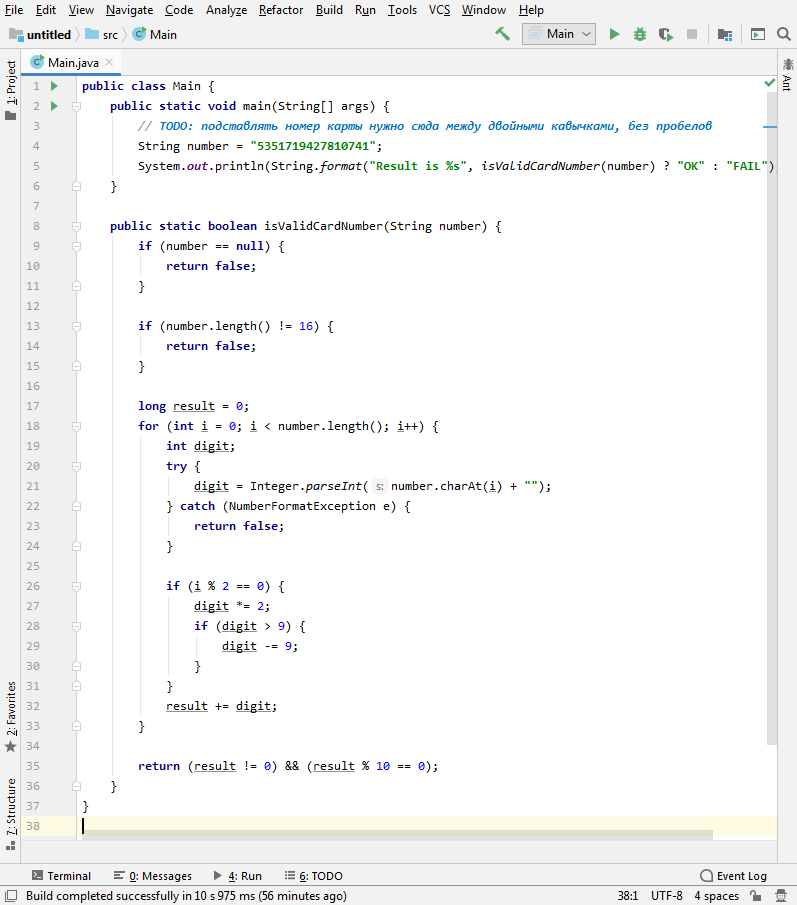

# Домашнее задание к занятию «1.1. Введение в Java: JDK, JRE, JVM, IntelliJ IDEA»

Не забывайте заводить по найденным багам баг-репорты в Github Issue.

В качестве результата пришлите ссылки на ваши GitHub-проекты в личном кабинете студента на сайте [netology.ru](https://netology.ru).

Все задачи этого занятия нужно делать в разных репозиториях.

**Важно**: если у вас что-то не получилось, то оформляйте Issue [по установленным правилам](../report-requirements.md).

**Важно**: не делайте ДЗ всех занятий в одном репозитории! Иначе вам потом придётся достаточно сложно подключать системы Continuous Integration.

## Как сдавать задачи

1. Инициализируйте на своём компьютере пустой Git-репозиторий
1. Добавьте в него готовый файл [.gitignore](../.gitignore)
1. Добавьте в этот же каталог необходимые файлы
1. Сделайте необходимые коммиты
1. Создайте публичный репозиторий на GitHub и свяжите свой локальный репозиторий с удалённым
1. Сделайте пуш (удостоверьтесь, что ваш код появился на GitHub)
1. Ссылку на ваш проект отправьте в личном кабинете на сайте [netology.ru](https://netology.ru)
1. Задачи, отмеченные, как необязательные, можно не сдавать, это не повлияет на получение зачета

## Задача №1 - Credit Card Number Validator

### Легенда

Вы попали в небольшой стартап, который помогает осуществлять приём платежей с банковских карт различным организациям.

Стартап находится в самом этапе зарождения, поэтому первое, что они решили сделать - реализовать функциональность валидации номера банковской карты.

Но как всегда бывает в стартапах, программист, который взялся реализовывать эту функциональность, исчез и не отвечает на звонки.

Но от него остались некоторые наработки вот в таком виде:
```java
public class Main {
  public static void main(String[] args) {
    // TODO: подставлять номер карты нужно сюда между двойными кавычками, без пробелов
    String number = "5351719427810741";
    System.out.println(String.format("Result is %s", isValidCardNumber(number) ? "OK" : "FAIL"));
  }

  public static boolean isValidCardNumber(String number) {
    if (number == null) {
      return false;
    }

    if (number.length() != 16) {
      return false;
    }

    long result = 0;
    for (int i = 0; i < number.length(); i++) {
      int digit;
      try {
        digit = Integer.parseInt(number.charAt(i) + "");
      } catch (NumberFormatException e) {
        return false;
      }

      if (i % 2 == 0) {
        digit *= 2;
        if (digit > 9) {
          digit -= 9;
        }
      }
      result += digit;
    }

    return (result != 0) && (result % 10 == 0);
  }
}
```

Что вам нужно сделать:
1. Установить IntelliJ IDEA согласно [Руководство по установке IntelliJ IDEA](idea.md)
2. Проверить работу этой программы (нужно заменить код с "Hello programming!" целиком на тот, что приведён выше) и запускать программу с разными тестовыми данными (запуск описан в п. "Шаг 20" Руководства по установке IntelliJ IDEA)
3. Подготовьте отчёт о проведённом тестировании в [указанном формате](report.md) и разместите его в репозитории. Инструменты форматирования текста в .md-файлах вы можете найти [здесь](https://www.markdownguide.org/basic-syntax/) или открыть [шаблон](report.md) и нажать на кнопочку Raw справа сверху.

**Важно**: вам не нужно разбираться в самом коде и пытаться его понять, вам нужно лишь научиться его запускать и менять номер карты на 4-ой строке.

**Важно**: внимательно следите за тем, чтобы в отчёты **не попадали реальные номера карт** (на данный момент* это неприемлимая практика тестировать на собственных данных: персональных, платёжных и других).

Примечание*: мы отдельно будем говорить, когда это не только допустимо, но и нужно.

<details>
  <summary>Подсказка</summary>

  Если вы всё сделаете правильно, то ваше окно IDEA должно выглядеть вот так:
  
   
</details>

<details>
  <summary>Где брать номера карт 😈?</summary>
  
  Короткий ответ: в Google, например, по запросу "credit card number generator".
  
  Длинный ответ: есть специальные сервисы, которые умеют генерировать валидные номера карт, например, [freeformatter.com](https://www.freeformatter.com/credit-card-number-generator-validator.html)
</details>

Итого: у вас должен быть репозиторий на GitHub, в котором расположен отчёт о проведённом тестировании и заведены баг-репорты в Issues (если баги есть).

## Задача №2 - KeyValidator*

**Важно**: это необязательная задача. Её (не)выполнение не влияет на получение зачёта по ДЗ.

### Предыстория

Иногда, нам как тестировщикам, везёт - и мы получаем от разработчиков (программистов) уже готовый и настроенный испытательный стенд (машину, где мы можем выполнять функциональное тестирование).

Достаточно часто нам приходится с нуля устанавливать и настраивать необходимое окружение для приложения, и не потому, что у разработчиков нет времени, они ленивые или вредные 😈, а потому что:
1. Нужно протестировать документацию
1. Нужно протестировать установку
1. Нужно протестировать совместимость

Поэтому вам нужно привыкать по готовым инструкциям устанавливать, настраивать и запускать ПО.

### Легенда

Вы участвуете в Legacy (проект с унаследованным кодом), в котором есть небольшое приложение, проверяющее лицензионные ключи.

Приложение написано на языке Java (значит вам нужно установить Java) и работает из командной строки.

Что нужно проверить:
1. Инструкция по установке OpenJDK11 работает под вашу ОС (если у вас ещё не установлена Java 11)
1. Приложение запускается и совместимо с Java 11
1. Приложение работает согласно руководству использования 

Документация:
* [Инструкция по установке OpenJDK 11](openjdk11-manual.md)
* [Руководство использования](user-manual.md)

Подготовьте отчёт о проведённом тестировании в [указанном формате](report.md) и разместите его в репозитории.

<details>
  <summary>Подсказка</summary>
  
  Что-то мне подсказывает, что при копировании таких "длинных" серийных номеров кто-то мог ошибиться.
</details>

Итого: у вас должен быть репозиторий на GitHub, в котором расположен отчёт о проведённом тестировании и заведены баг-репорты в Issues (если баги есть).

