# Инструкция по установке OpenJDK11

**Важно**: если у вас что-то не получилось, то оформляйте Issue [по установленным правилам](../report-requirements.md).

## Windows

Шаг 1. Перейдите на сайт [adoptopenjdk.net](https://adoptopenjdk.net). 

Шаг 2. Выберите опции как на скриншоте ниже и нажмите на кнопку скачивания:

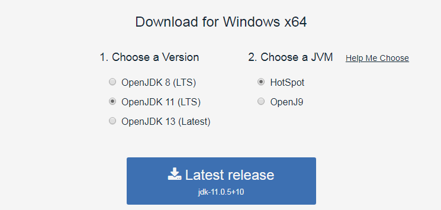

Шаг 3. Запустите на установку скачанный MSI-файл и нажмите кнопку "Next":

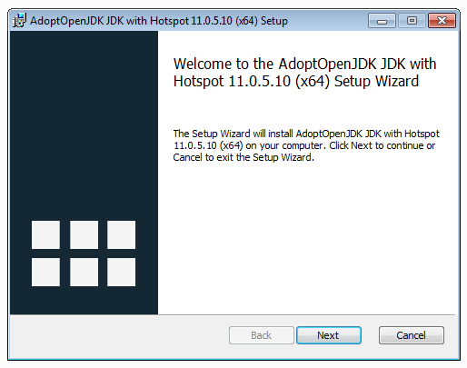

Шаг 4. Прочитайте и согласитесь с условиями лицензии:

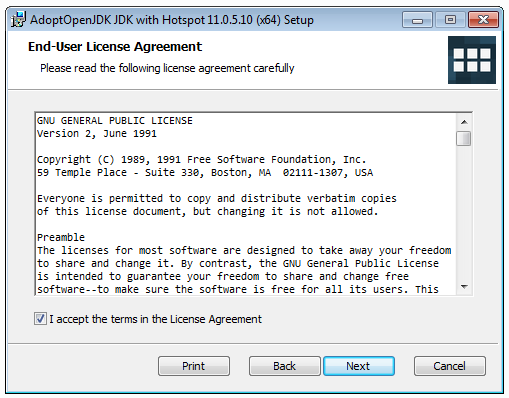

Шаг 5. Выберите опции как на экране (удостоверьтесь, что установка происходит в `Program Files` и опция `Add to PATH` выбрана):

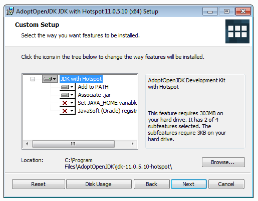

Шаг 6. Нажмите на кнопку "Install":

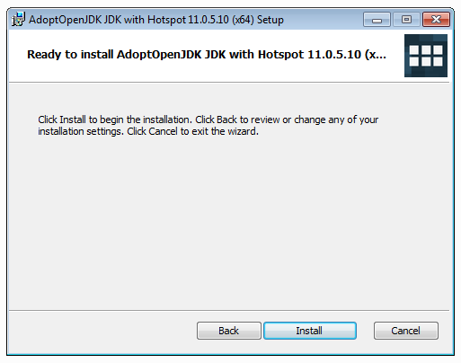

Шаг 7. Дождитесь окончания установки и нажмите на кнопку "Finish":

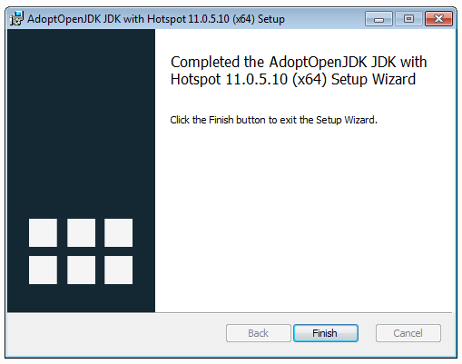

Откройте терминал и выполните команду:
```shell script
java -version
```

```
openjdk version "11.0.5" 2019-10-15
OpenJDK Runtime Environment AdoptOpenJDK (build 11.0.5+10)
OpenJDK 64-Bit Server VM AdoptOpenJDK (build 11.0.5+10, mixed mode)
```

**Важно**: вы должны открывать терминал уже после того, как произвели установку.

## MacOS

Шаг 1. Перейдите на сайт [adoptopenjdk.net](https://adoptopenjdk.net). 

Шаг 2. Выберите опции как на скриншоте ниже и нажмите на кнопку скачивания:

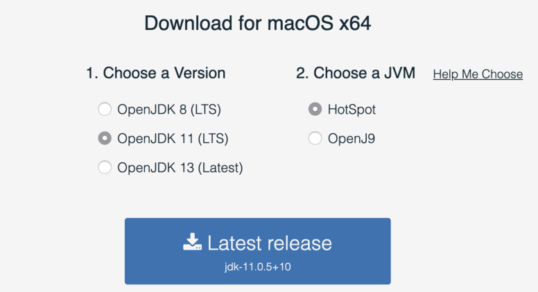

Шаг 3. Запустите на установку скачанный PKG-файл и нажмите кнопку "Продолжить":

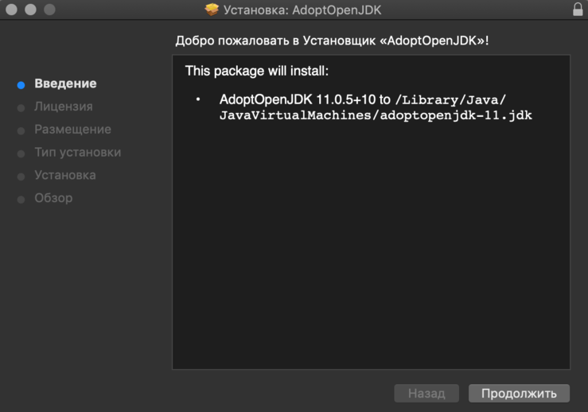

Шаг 4. Прочитайте и согласитесь с условиями лицензии:

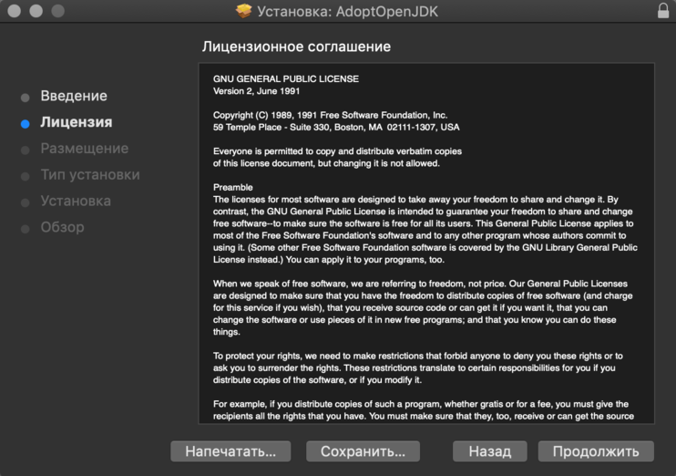

Шаг 5. Выберите диск для установки:

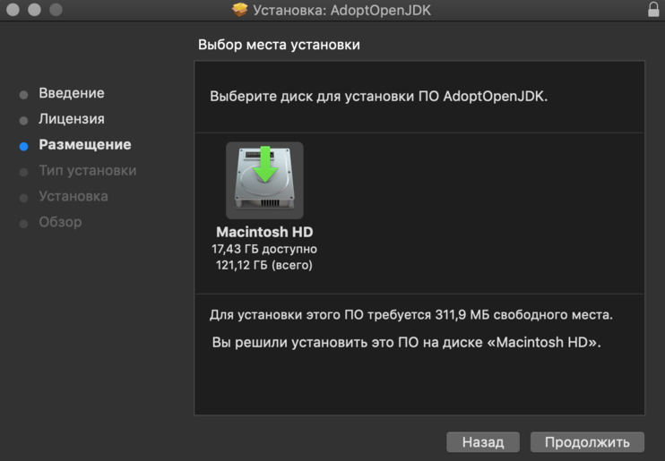

Шаг 6. Нажмите на кнопку "Установить":

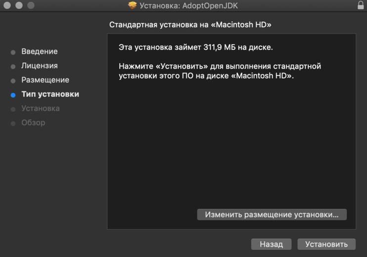

Шаг 7. Дождитесь окончания установки и нажмите на кнопку "Закрыть":

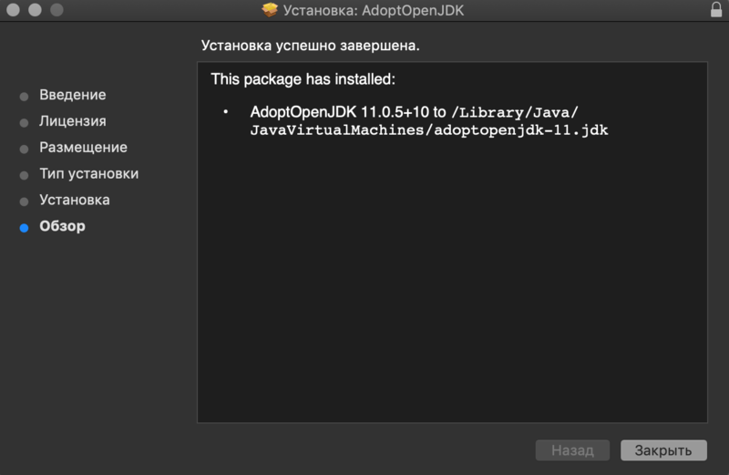

Откройте терминал и выполните команду:
```shell script
java -version
```
Вы должны увидеть вывод подобный:
```
openjdk version "11.0.5" 2019-10-15
OpenJDK Runtime Environment AdoptOpenJDK (build 11.0.5+10)
OpenJDK 64-Bit Server VM AdoptOpenJDK (build 11.0.5+10, mixed mode)
```

**Важно**: вы должны открывать терминал уже после того, как произвели установку.

## Linux

Указанные инструкции приведены для дистрибутива Ubuntu 18.04+. Если у вас другой дистрибутив Linux - пишите в канал Slack.

Откройте консоль (`Ctrl + Alt + T` в Ubuntu 18+). В консоли выполните следующие команды:

```shell script
sudo apt update
sudo apt install openjdk-11-jdk openjdk-11-source
```

Удостоверьтесь, что java установлена:
```shell script
java -version
```

Вы должны увидеть вывод подобный:
```
openjdk version "11.0.5" 2019-10-15
OpenJDK Runtime Environment (build 11.0.5+10-post-Ubuntu-0ubuntu1.1)
OpenJDK 64-Bit Server VM (build 11.0.5+10-post-Ubuntu-0ubuntu1.1, mixed mode, sharing)
```
