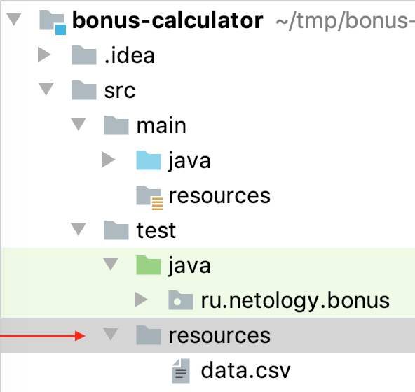
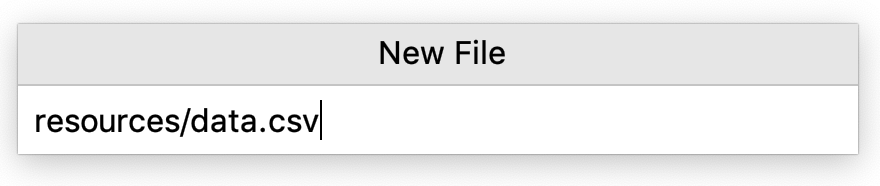
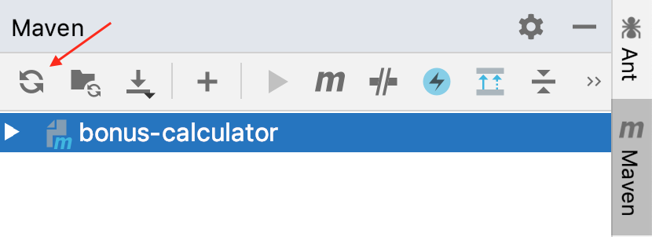
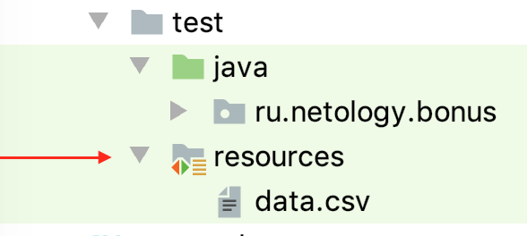
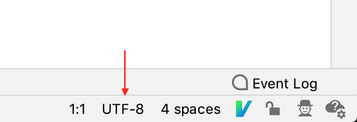
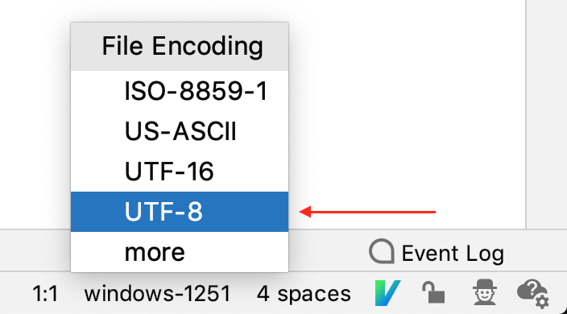

# Домашнее задание к занятию «Циклы, параметризованные тесты и аннотации. Часть 2.»

Не забывайте заводить по найденным багам баг-репорты в Github Issue.

В качестве результата пришлите ссылки на ваши GitHub-проекты в личном кабинете студента на сайте [netology.ru](https://netology.ru).

Все задачи этого занятия нужно делать в разных репозиториях.

**Важно**: если у вас что-то не получилось, то оформляйте Issue [по установленным правилам](../report-requirements.md).

**Важно**: не делайте ДЗ всех занятий в одном репозитории! Иначе вам потом придётся достаточно сложно подключать системы Continuous Integration.

Напоминалку по некоторым теоретическим моментам в джаве вы можете найти [здесь](../tips/tips.md).

## Как сдавать задачи

1. Инициализируйте на своём компьютере пустой Git-репозиторий
1. Добавьте в него готовый файл [.gitignore](../.gitignore)
1. Добавьте в этот же каталог необходимые файлы
1. Сделайте необходимые коммиты
1. Создайте публичный репозиторий на GitHub и свяжите свой локальный репозиторий с удалённым
1. Сделайте пуш (удостоверьтесь, что ваш код появился на GitHub)
1. Ссылку на ваш проект отправьте в личном кабинете на сайте [netology.ru](https://netology.ru)
1. Задачи, отмеченные, как необязательные, можно не сдавать, это не повлияет на получение зачета (в этом ДЗ все задачи являются обязательными)

## Задача №1 - Статистика

### Легенда

Статистика - очень важный компонент любого бизнеса. У вас есть набор данных о продажах конкретного предприятия по месяцам: `[8, 15, 13, 15, 17, 20, 19, 20, 7, 14, 14, 18]`.

Вам поручили написать небольшой сервис (программисты все заняты), который умеет по предоставленному ему массиву месячных продаж рассчитывать:
1. Сумму всех продаж
2. Среднюю сумму продаж в месяц
3. Номер месяца, в котором был пик продаж (осуществлены продажи на максимальную сумму)*
4. Номер месяца, в котором был минимум продаж (осуществлены продажи на минимальную сумму)*
5. Кол-во месяцев, в которых продажи были ниже среднего (см. п.2)
6. Кол-во месяцев, в которых продажи были выше среднего (см. п.2)

Примечание:* внимательно посмотрите на данные о продажах и подумайте, какая здесь может быть ловушка 😈.

<details>
  <summary>Подсказка</summary>
  
  Именно здесь скрыта типичная ошибка поиска - вам всегда нужно уточнять, что вы ищете: первый, последний или все элементы.
  
  В вашем задании нужно найти последний месяц, соответствующий условиям.
</details>

Сервис должен представлять с собой один класс с шестью методами - по методу на пункт; входные данные для рассчёта сервис должен принимать в параметрах своих методов. Обратите внимание, что написанный класс должен уметь работать с любыми значениями в массиве продаж, а приведённый выше набор это лишь пример данных для ваших тестов на методы создаваемого класса.

Метод ниже считает номер месяца минимальных продаж. Логика его такова: заводим переменную `minMonth` для хранения номера ячейки в массиве того месяца, в котором были минимальные продажи среди всех уже просмотренных; изначально мы никакие ещё не просмотрели, потому запишем туда номер 0. Будем циклом поочерёдно смотреть месяцы продаж: на каждой итерации у нас в `sale` будет количество продаж в рассматриваемом месяце, в `month` - номер этого рассматриваемого месяца. Если мы смотрим на месяц в котором продажи меньше чем в минимальном из просмотренных ранее (чей номер запомнен в `minMonth`), то считаем теперь этот рассматриваемый месяц минимальным (присваиваем в `minMonth` значение `month`). И так до конца массива продаж, тогда после цикла в `minMonth` у нас будет лежать номер месяца минимальных продаж. Останется только один момент: мы нумеровали месяцы с нуля (тк в массивах ячейки нумеруются с нуля), потому отдавая ответ нам надо прибавить 1.

```java
public int minSales(long[] sales) {
  int minMonth = 0;
  int month = 0; // переменная для индекса рассматриваемого месяца в массиве
  for (long sale : sales) {
    // sales[minMonth] - продажи в месяце minMonth
    // sale - продажи в рассматриваемом месяце
    if (sale <= sales[minMonth]) {
      minMonth = month;
    }
    month = month + 1; // следующий рассматриваемый месяц имеет номер на 1 больше
  }
  return minMonth + 1;
}
```

Вам необходимо:
1. Создать Maven проект, в котором в package `ru.netology.stats` будет класс `StatsService` с необходимыми методами (сами придумайте им говорящие названия*)
1. Написать на каждый метод по одному автотесту, который проверяет правильность работы на тестовых данных** 
1. Убедитесь, что ваши автотесты работают и проходят (для этого пробуйте "ронять" каждый свой тест и удостоверяйтесь, что он действительно падает).

Итого: у вас должен быть репозиторий на GitHub, в котором расположен ваш Java-код и автотесты к нему.
    
Примечание:* имена методов с маленькой буквы, на правильном английском без транслитерации и сокращений. Не должно быть никаких `f`, `calc1`, `cMin` и т.д. В то же время перебарщивать тоже не надо: `findMonthIndexWithMinimumTotalAmountOfPurchases` не есть хорошо.

Примечание:** тестируйте в первую очередь на выданных вам данных, т.к. если на выданных вам данных приложение работает неправильно, то уже всё равно, как оно работает на других данных.

**Важно**: старайтесь отвыкать от создания класса `Main` и проверки работы приложения через него. Помните, что для проверки у вас есть Maven и автотесты.

## Задача №2 - "@CsvFileSource"*

**Важно**: это необязательная задача. Её (не)выполнение не влияет на получение зачёта по ДЗ.

### Легенда

Мы с вами на лекции разобрали аннотацию `@CsvSource`, внутри которой можно писать строки в формате CSV.

Писать значения прямо в аннотации неплохо, но если их будет штук 50 - то, наверное, ничего хорошего из этого не выйдет.

Поэтому неплохо бы воспользоваться возможностями JUnit и аннотации `@CsvFileSource`.

Вам необходимо взять [проект с лекции](https://github.com/netology-code/javaqa-code/tree/master/2.4_params/bonus-calculator) и дописать оставшиеся непроверенными сценарии таким образом, чтобы данные читались из файла формата CSV.

Сам файл необходимо положить в каталог `resources` (каталог `resources` тоже нужно создать) следующим образом:



Быстро это сделать можно вот так: `Alt + Insert` на каталоге `test` выбираете `New File` и дальше вводите имя файла вместе с именем каталога:



IDEA сама за вас создаст и каталог, и файл.

После чего в боковой панельке следует сделать reimport Maven-проекта:



И IDEA поставит вам красивую иконочку на ресурсы для тестов:



Сам файл вы можете редактировать прямо в IDEA (это обычный текстовый файл, но подчиняющийся правилам CSV).

При этом обратите внимание, что кодировка файла UTF8:



Если это не так - кликните на указанном поле и выберите UTF8:



Вам нужно: загрузить исходные коды для этой аннотации (делается через IDEA), прочитать комментарии к элементам аннотации и использовать только те, которые нужны.

Переделанный проект нобходимо загрузить на GitHub (предварительно удостоверьтесь, что ваши тесты работают).

Итого: у вас должен быть репозиторий на GitHub, в котором расположен ваш Java-код и автотесты к нему.

Важно: путь к файлу нужно будет указывать вот так: `/data.csv` - это будет означать, что ищем в каталоге `resources`.

Важно: когда элемент аннотации требует массив, но вы передаёте всего один элемент, то можно не писать фигурные скобки.

Например, на лекции было (`value` требовал массив):
```java
  @CsvSource(
      value={
          "'registered user, bonus under limit',100060,true,30",
          "'registered user, bonus over limit',100000060,true,500"
      }
  )
```

Если элемент в массиве только один, то полная запись:
```java
  @CsvSource(
      value={
          "'registered user, bonus under limit',100060,true,30"
      }
  )
```

Сокращённая (работает только с одним элементом):
```java
  @CsvSource(value="'registered user, bonus under limit',100060,true,30")
```

А если вы везунчик и элемент ещё и называется `value`, то:
```java
  @CsvSource("'registered user, bonus under limit',100060,true,30")
```

<details>
  <summary>Подсказка</summary>
  
  Использованная аннотация должна выглядеть следующим образом:
  ```java
  @CsvFileSource(resources = "/data.csv")
  ```
</details>
